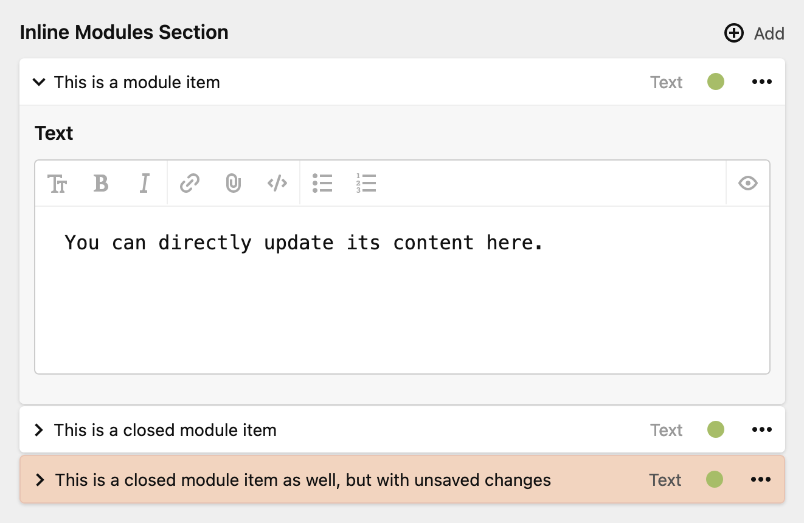

**Inline Modules** is an extension for [Thomas Günther's Modules plugin](https://github.com/medienbaecker/kirby-modules/) which offers inline editing for modules sections.

## Installation

### Download

Download and copy this repository to `/site/plugins/modules-inline`.

### Git submodule

```
git submodule add https://github.com/hananils/kirby-modules-inline.git site/plugins/modules-inline
```

### Composer

```
composer require hananils/kirby-modules-inline
```

## Usage

Setup the Modules plugin as per the docs and add `layout: module` to your modules section definition in your blueprint to enable inline editing:



# License

This plugin is provided freely under the [MIT license](LICENSE.md) by [hana+nils · Büro für Gestaltung](https://hananils.de). We create visual designs for digital and analog media.
